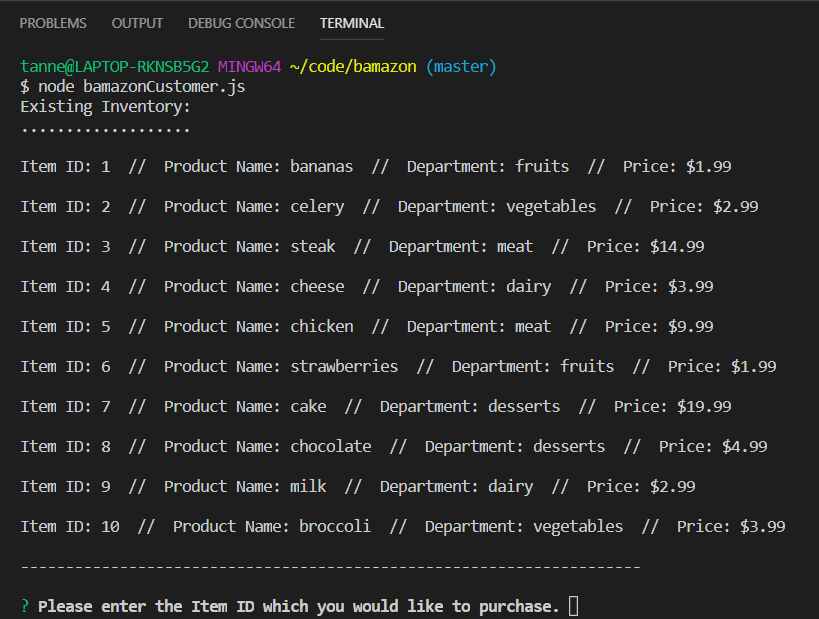
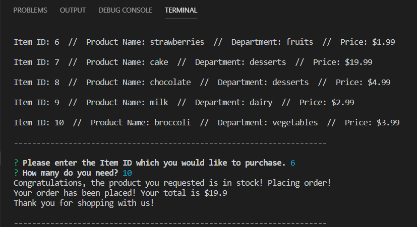
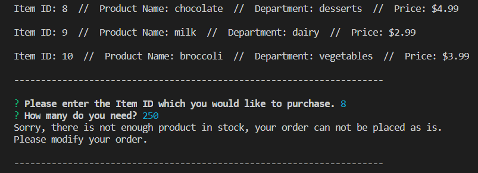

# bamazon
Overview
In this activity, you'll be creating an Amazon-like storefront with the MySQL skills you learned this unit. The app will take in orders from customers and deplete stock from the store's inventory. As a bonus task, you can program your app to track product sales across your store's departments and then provide a summary of the highest-grossing departments in the store.

## Instructions:
In order to view items for purchse the user would open the terminal and type "node bamazonCustomer.js".

Bamazon Inventory

Ordered Product Success

Ordered Product Fail

